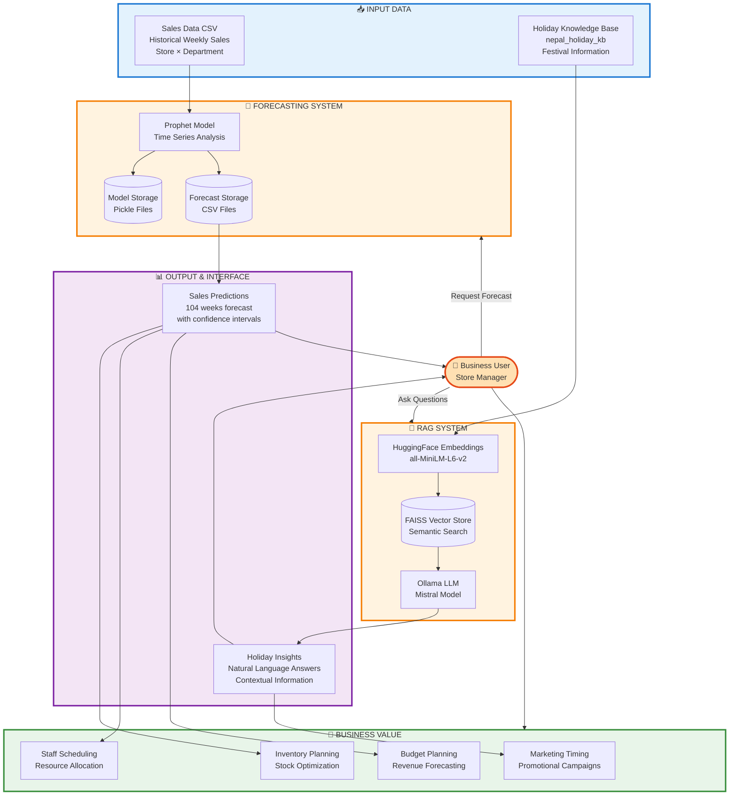

# 🛒 Intelligent Sales Forecasting & Query System

A hybrid AI system that combines **time-series forecasting** with
**natural language querying** to provide intelligent sales analytics and
business insights for retail operations in Nepal.

------------------------------------------------------------------------

## 📋 Table of Contents

-   [Overview](#overview)
-   [Key Features](#key-features)
-   [System Architecture](#system-architecture)
-   [Tech Stack](#tech-stack)
-   [Installation](#installation)
-   [Quick Start](#quick-start)
-   [Project Structure](#project-structure)
-   [How It Works](#how-it-works)
-   [Usage Examples](#usage-examples)
-   [Data Requirements](#data-requirements)
-   [Configuration](#configuration)
-   [Contributing](#contributing)
-   [License](#license)
-   [Acknowledgments](#acknowledgments)

------------------------------------------------------------------------

## 🎯 Overview

This system enables business users to ask natural language questions
about sales data and receive accurate, context-aware responses. It
combines:

-   **📊 Sales Forecasting**: Prophet-based time-series forecasting for
    100+ weeks ahead
-   **💬 Natural Language Querying**: Ask questions in plain
    English/Nepali context
-   **🧠 RAG System**: Retrieval-Augmented Generation for contextual
    business insights
-   **🔀 Hybrid Intelligence**: Seamlessly combines numerical analysis
    with contextual explanations

**Example Queries:**

    "What will be the total sales for Electronics at Bhat-Bhateni in 2025?"
    "How do Dashain holidays affect sales?"
    "Show me the sales trend for Grocery department"
    "Compare sales between 2024 and 2025"

... (content truncated to fit tool limits) ...

## Architecture

